# Build manual

Read this document from start to end before proceeding. Ensure you understand everything.

## Overview

1. Get the required tools and parts.
2. Disassemble your CSUH.
3. Get a quick release adapter done.
4. Upload the firmware.
5. Build the circuitry.
6. Replace and build some connectors.
7. Assemble

## Section I: Requisites

Obviously, you need a ClubSport Universal Hub (*CSUH* from now on) to start with. You may find this conversion suitable for other sim wheels.
You also need a quick release (*QR* from now on) suitable for your wheel base. We are assuming that such a QR is a 70mm or 50mm standard.

### Wheel base and computer

It is required for your wheel base to provide a power source through the quick release: **5** volts of direct current (DC). For example, this is the case of *Simagic* bases but not of *SimuCube* ones. Higher voltages, up to 12 volts are allowed, but it will heat up the circuit board.

Your computer needs Bluetooth Low Energy (BLE) connectivity version 4.2 or higher. If not available, buy an USB dongle.

> [My choice (ASUS USB-BT500)](https://www.asus.com/us/networking-iot-servers/adapters/all-series/usb-bt500/)

### Hardware tools

Required:

- [Soldering iron](https://en.wikipedia.org/wiki/Soldering_iron) for electronics, with a sharp point.
- Basic tools commonly found in any home: Allen keys, screwdriver, cutting pliers, pliers and a cutter.
- Lighter (used to strip wires).
- Micro-USB cable for PC.
- Drill
- Drill bits sized 3mm, 4.2mm and 5mm. The 4.2mm and 5mm drill bits may be not needed depending on the quality of the CNC or 3D printing process (see below).
- [Threading tap](https://duckduckgo.com/?q=threading+tap+m5&iax=images&ia=images) sized M5.

Highly recommended:

- ["Third hand"](https://en.wikipedia.org/wiki/Helping_hand_(tool)).
- Soldering stand.
- A tool to remove unwanted solder points.

Those tools may be found in a cheap soldering kit.

### Software tools

Required:

- [Arduino IDE](https://www.arduino.cc/en/software). Choose a stable release and follow instructions.
- Official [Arduino-ESP32 support package](https://docs.espressif.com/projects/arduino-esp32/en/latest/getting_started.html). Follow [this link](https://docs.espressif.com/projects/arduino-esp32/en/latest/installing.html) for installation instructions.
- [NimBLE-Arduino](https://www.arduino.cc/reference/en/libraries/nimble-arduino/). An [Arduino library](https://docs.arduino.cc/software/ide-v1/tutorials/installing-libraries) that can be installed from Arduino IDE itself. Install dependencies as well.
- [ESP32 drivers](http://esp32.net/usb-uart/) on Windows. A tutorial: [Installing drivers for the ESP32](https://www.bromleysat.com/installing-drivers-for-the-esp32/).

Recommended:

- [Planet pointy's joystick test application](http://www.planetpointy.co.uk/joystick-test-application/) (for Windows).
- [DIY layout creator](https://bancika.github.io/diy-layout-creator/). [Alternate link](https://github.com/bancika/diy-layout-creator/releases).
- [FreeCAD](https://www.freecadweb.org/)

### Skills

Required:

- Basic soldering for electronics and building traces on perfboards. There are lots of tutorials on the Internet. For example:
  
  - [How to solder properly](https://www.youtube.com/watch?v=VxMV6wGS3NY)
  - [Using Perfboard](https://www.youtube.com/watch?v=l9Kbr8cPqOE)

- Compile, upload and run Arduino's *sketches* using *Arduino IDE*. There is an [official tutorial](https://docs.arduino.cc/software/ide-v2/tutorials/getting-started/ide-v2-uploading-a-sketch).

### Other

- A micro-USB cable, required to upload the firmware into the *devkit*.

### Needed parts

Please, read carefully the notes below the following table.

| Part                                                                          | Quantity  | Role                                         |
| ----------------------------------------------------------------------------- | :-------: | -------------------------------------------- |
| Expressif's ESP32-WROOM-32UE (DevKit-C) with male pins already soldered       |     1     | Heart and brain of the circuit               |
| External antenna with U.FL, MHF I or AMC connector                            |     1     | Wireless communications                      |
| Unpolarized ("flat") pin header rows x40 (includes both male and female pins) |  3 rows   | Sockets and connectors                       |
| Thin wire                                                                     | 1/2 meter | Electrical contacts                          |
| 10k-ohms resistors                                                            |     4     | Pulldown resistors                           |
| Standard perfboard sized 24x18 holes (7cm x 5 cm)                             |     1     | Circuit board that holds everything together |
| Rotary encoder                                                                |     1     | Extra input                                  |
| A knob for the rotary encoder                                                 |     1     | Extra input                                  |
| Dupond wires, the kind used in prototyping boards (optional)                  | See below | Connect external inputs to the circuit board |
| Black-colored isolating tape                                                  |  unknown  | Cover holes an keep wires in place           |
| Welding tin                                                                   |  18 gr.   | Tracks and electrical contacts               |
| A matching connector to your wheel base                                       |     1     | Get power from the wheel base                |
| Wooden toothpicks                                                             |     2     | Keep the LED display in its place            |
| A piece of cardboard (1 mm thick or so)                                       |     1     | Electrical isolation                         |

- **ESP32-WROOM-32UE**. Note the "UE" in the model name. That model uses an external antenna, while the "ESP32-WROOM-32E" uses a built-in antenna. You may try the last one, but it may not work due to the metal housing blocking radio waves (not tested). If you try, please, leave a comment on the result. Ensure it has male pins already soldered. There are many unofficial clones of this *devkit* board that should work, but may not (be warned).
  
  > [My choice](https://es.aliexpress.com/item/4000296658456.html?spm=a2g0o.productlist.0.0.8c0d3e47Lkm4OY&algo_pvid=2900aa16-8cac-4958-9bb6-25ba070daec9&algo_exp_id=2900aa16-8cac-4958-9bb6-25ba070daec9-11&pdp_ext_f=%7B%22sku_id%22%3A%2210000001533619951%22%7D&pdp_pi=-1%3B5.89%3B-1%3BEUR+0.60%40salePrice%3BEUR%3Bsearch-mainSearch)

- **External antenna**. A greater quantity is recommended just in case. They are sold in packs of 5 or 10 units.
  
  > [My choice](https://es.aliexpress.com/item/4001057394662.html?spm=a2g0o.store_pc_allProduct.8148356.68.6c0a3c48oJZt0R)

- **Pin headers**. Those are more than required. They are sold in rows, each row contains 40 male and 40 female pins. You will cut a row into smaller pieces and some pins will be destroyed in the process. As a consequence, you should get more pins than strictly needed, just in case.
  
  > [My choice](https://es.aliexpress.com/item/1005002666646897.html?spm=a2g0o.store_pc_groupList.8148356.6.59fe4c20spX1nh1&pdp_ext_f=%7B%22sku_id%22%3A%2261272184014%22%7D&pdp_pi=-1%3B3.2%3B-1%3BEUR+1.01%40salePrice%3BEUR%3Bsearch-mainSearch)

- **Thin wire**. The stated quantity should suffice but it is up to you. See note on Dupond wires, below.

- **10k-ohms resistors**. This is indicative. An higher impedance will work. Any tolerance is suitable, too.

- **Perfboard**. This board fits in the housing almost perfectly. You may also get an over sized perfboard and then cut it down to the required size. Again, you should get a greater quantity just in case, specially if you have little experience in soldering. A double sided perfboard is recommended, but a single sided perfboard will work.
  
  > [My choice](https://es.aliexpress.com/item/4000817854796.html?spm=a2g0o.store_pc_allProduct.8148356.6.6c0a3c48oJZt0R)

- **Rotary encoder**. There are two choices:
  
  - **Bare bone**: just a mechanical device with no pull resistors. This is **recommended** since it will fit perfectly.
  - **KY-040**: a bare bone rotary encoder with pull-up resistors. Be aware that it may no fit inside the housing, depending on what you buy. However, the circuit is prepared for it.
  
  > [My choice (KY-040)](https://es.aliexpress.com/item/32924953282.html?spm=a2g0o.store_pc_allProduct.8148356.30.742c28aeKdV82o)

- **Knob**. Make sure it fits in the rotary encoder.

- **Dupond wires**, the kind used for prototyping. Not required but will make your life much easier. They are sold in kits. You may also sacrifice some of them in replacement for the thin wire.

- **Welding tin**. It is sold in small tubes. One of them should suffice. Make sure it has a "flux" core.

- **Connector to the wheel base**. It must match your wheel base. Make sure to identify the positive (`5V`) and negative (`GND`) terminals **correctly**. Most times, negative: black wire, positive: red wire. If you have a **Simagic QR**, `GND`is the yellow wire and `5V` is the green one. Dupond wires may do the trick, too.

- **Cardboard**. Belive it or not, this is a **critical part**. Cut a piece of cardboard to the same shape and size of the perfboard.

## Section II: Build instructions

### Disassemble your CSUH

There are some tutorials on the Internet, so I am not covering this here. For example: [Fanatec Universal Hub Connector Pin Replacement Tutorial](https://www.youtube.com/watch?v=eCBfZpLCOsQ).

**Do not throw anything away** yet. We are reusing many components.

### QR adapter

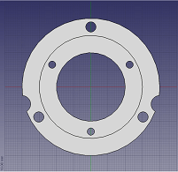

Fanatec's QR is a non-standard 52mm one, so you need an adapter. Contact a local provider to get it done. There are 3D models for both 50mm and 70mm standards and for two manufacturing processes: 3D printing (plastic) and CNC (aluminium). Choose whatever meets your budget and availability.

#### 3D printing

You need a strong and rigid QR adapter, so it must be printed in **high density** and **ABS, ASA or nylon** materials. This has been tested and it works perfectly.

- 50 mm adapter:
  - [FreeCAD format](../CAD/QRadapter52to50mm/QRAdapter52To50_3Dprint.FCStd)
  - [Alias Mesh](../CAD/QRadapter52to50mm/QRAdapter52To50_3Dprint.obj)
  - [STL Mesh](../CAD/QRadapter52to50mm/QRAdapter52To50_3Dprint.stl)
- 70 mm adapter:
  - [FreeCAD format](../CAD/QRadapter52to70mm/QRAdapter52to70_3Dprint.FCStd)
  - [Alias Mesh](../CAD/QRadapter52to70mm/QRAdapter52to70_3Dprint.obj)
  - [STL Mesh](../CAD/QRadapter52to70mm/QRAdapter52to70_3Dprint.stl)

Since 3D printing is not 100% accurate, use a 4.2mm drill bit on inner screw holes, and a 5mm drill bit on outer screw holes.

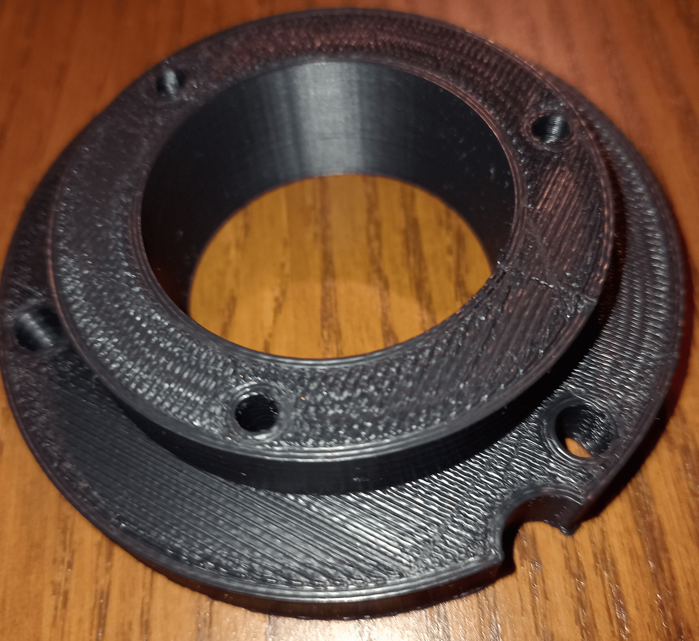

#### CNC

To be cut from a 18mm-thick aluminium plate.

- 50 mm adapter:
  - [FreeCAD format](../CAD/QRadapter52to50mm/QRAdapter52To50_CNC.FCStd)
  - [Alias Mesh](../CAD/QRadapter52to50mm/QRAdapter52To50_CNC.obj)
  - [STL Mesh](../CAD/QRadapter52to50mm/QRAdapter52To50_CNC.stl)
- 70 mm adapter:
  - [FreeCAD format](../CAD/QRadapter52to70mm/QRAdapter52to70_CNC.FCStd)
  - [Alias Mesh](../CAD/QRadapter52to70mm/QRAdapter52to70_CNC.obj)
  - [STL Mesh](../CAD/QRadapter52to70mm/QRAdapter52to70_CNC.stl)

#### Threads

The holes at the inner 52mm circle need a thread for M5 screws. Use a threading tap on them. Make sure you build the threads in the proper direction: clockwise with the narrower part of the 70mm QR adapter facing to you, or the mounting holes of the 50mm QR adapter facing to you.

**Note:** You may thing that 3D printed plastic is not suitable for a thread. You are wrong. It works as well as a nut.

### Upload the firmware

The circuit board is not needed here, just the *ESP32-WROOM-32UE* devkit and a proper USB cable. Open the [".ino" file](../Firmware/Firmware.ino) with Arduino IDE and upload. Make sure all requisites (see above) are installed in Arduino IDE.

With the USB cable still there, press the reset button at the devkit. Turn bluetooth on at your computer, scan for devices and make sure that "CSUH sim wheel" shows up. You may pair it now if you wish.

### Build the circuitry

#### Mounting hole

The perfboard does not feature a practicable mounting hole. Take a drill and a 3mm (M3) drill bit.
Create a new hole at the top-right corner, second row, rightmost column, as shown in the picture below and in the circuit layout (see next chapter).
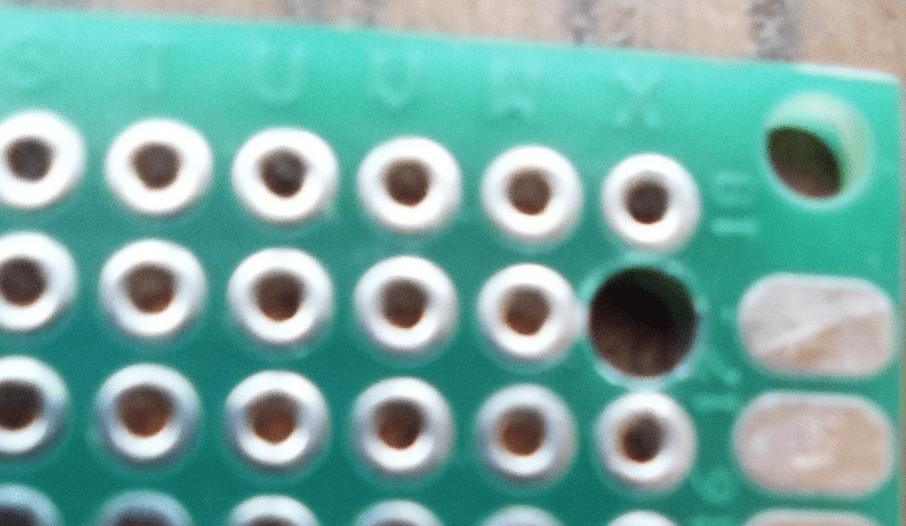

#### Circuit board

Open the [circuit layout](./Electronics/CSUH_circuit_board.diy) using [DIY Layout Creator](https://github.com/bancika/diy-layout-creator) or follow this picture:
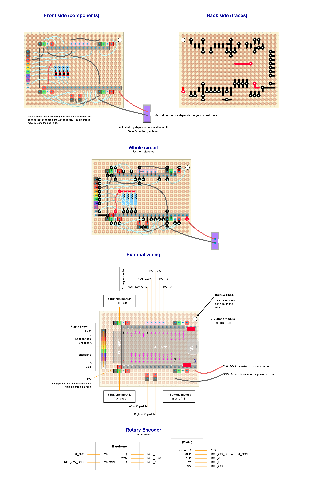

While looking at the circuit layout, keep in mind:

- Gray sockets are female pin headers, while other sockets are male pin headers. Those female headers are for the DevKit board.
- CSUH's wires matches the color of pin headers.
- The purple wire coming from the funky switch is unused.
- Pin headers, resistors and wires lay on the front side. If your perfboard is single-sided, that is the side with no electrical contacts. However, wires may also be soldered on the back side if you wish.
- Tin traces are built on the back side.
- Ignore the color of traces and wires. Red ones are connected to `3V3` or `5V`, black ones are connected to `GND`, that's all.
- Make sure the wires does not come in the way of the mounting hole.
- Use isolating tape to keep components in place while soldering on the back side. Make sure all pin headers are almost perfect perpendicular to the perfboard.
- There are five devkit pins, marked with a red square, not wired to anything. This is not a mistake.

#### Isolate

Cover all the back of the circuit board with the piece of cardboard and fix it with isolation tape. Otherwise, you will come into a short circuit. **This is critical. Do not ignore**. Isolation tape alone will not work.

Make a hole in the cardboard for the screw.

### Replace and build some connectors

#### New connectors for the 3-buttons modules and the funky switch

**Warning**: This chapter does **not** apply to shift paddles. Read the next chapter.

Those modules feature a JST 1.5mm connector which is incompatible with the 2mm perfboard and its pin headers. So, a replacement is needed:

1. Cut one or two female pin headers into pieces, matching the required sizes. Take into account that one extra pin will be sacrificed on each cut. These pin headers will act as connectors:

    - 4 connectors, 4 pins each, for the 3-buttons modules.
    - 1 connector, 10 pins, for the funky switch.

2. Cut the wires near their existing connector. We are not reusing those connectors.

3. Strip the wires and solder the new connectors. **Make sure to respect the existing order of the wires**:

    - 3-button modules: black --> green --> white --> red
    - Funky switch: black --> brown --> red --> orange --> yellow --> green --> blue --> purple (which is unused) --> grey --> white.

   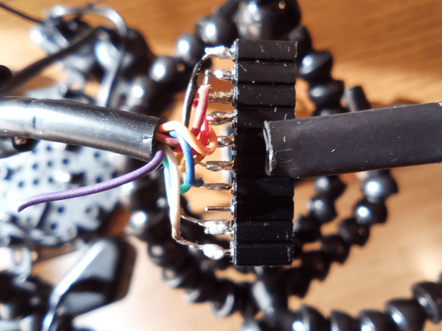

4. Take note of the pin attached to the black wire and put a mark on it, like the top pin at this picture:

   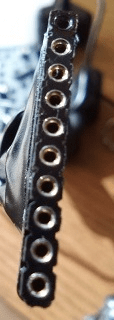

5. Isolate each individual joint with isolating tape (or a piece of paper). Otherwise, you may come into a short circuit.

   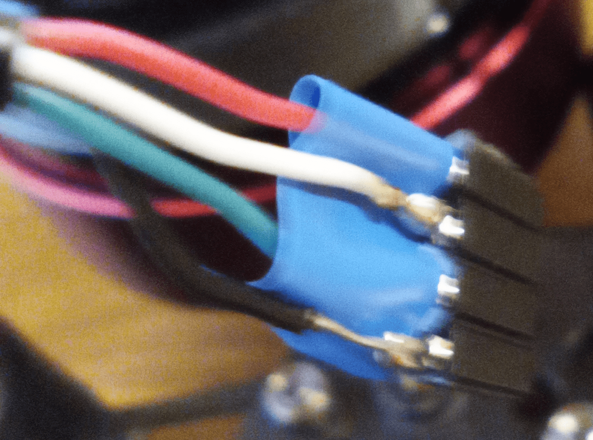

6. Surround the whole pin header and the bunch of wires with isolating tape.

   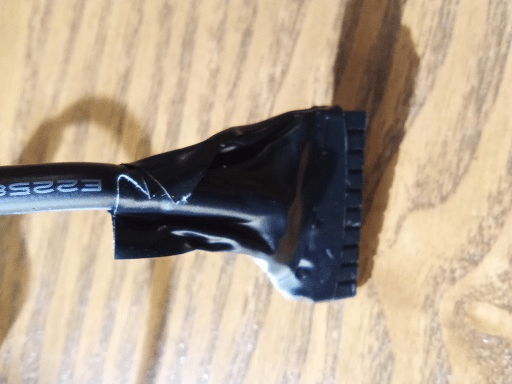

#### Wire extension for the shift paddles

Shift paddles also feature a JST 1.5mm connector. However, they can be plugged into 2mm male pins. Just bend them a little bit.

Unfortunately, their wires are **too short**, so, they need an extension. There are two choices:

- Use Dupond wires (recommended), the kind used for prototyping, male at one end (plug into the existing connector) and female at the other end (plug into the circuit board).

- Cut the wires, not near the existing connector, since we are reusing it. Solder another piece of wire between the existing wire and the connector. Use isolating tape around the joints. Make sure they do not make contact by accident.

**Note**: the position of these connectors is irrelevant, since their terminals (red and black) are interchangeable.

#### Connectors for the rotary encoder into the circuit board

We are talking here about the connectors that plug into the circuit board. The CSUH does not provide these connectors. Follow the same procedure as for the 3-button modules or just plug some Dupond wires. **Make sure you respect the designed order of the wires**:

- Barebone rotary encoder (5 pins): `GND` --> `COM` --> `SW` --> `B` --> `A`.
- KY-040 rotary encoder (5+1 pins): `unused` --> `GND` --> `SW` --> `CLK` --> `DT`. `Vcc or (+)` requires a separate wire with a single connector which plugs into `3V3`. A Dupond wire will do the job if you have one. Note that the board has been designed with a male pin at `3V3`.

#### Rotary encoder

We are talking here about a connector that plugs into the rotary encoder. For correct wiring, check the datasheet of your rotary encoder, or the printed labels.

They have 2mm pins, so build another connector for it, or use Dupond wires. In any case, take into account that the order of those pins may not match the designed order at the circuit board. You may solder the wires directly, too.

### Test everything

Plug an USB cable, the additional rotary encoder and all the CSUH's connectors into the circuit board in order to check that it works. Don't forget to plug the external antenna. Turn bluetooth on at your computer, scan for devices and pair the "CSUH sim wheel" device (if not done yet).

Use a joystick/gamepad test application or test the device from it's properties page (on Windows). Check that every button and rotary is recognized. If not, look for mistakes at the wiring and the circuit board.

## Assemble

Take note of the assembling order. This is **important**:

1. Attach your QR to the QR adapter.

2. Attach the LED segment display to the CSUH's housing.

3. Put some screws in their holes.

4. Cover the holes left by unused rubber buttons.

5. Attach the rotary encoder to the CSUH's housing.

6. Attach the QR adapter to the CSUH's housing.

7. Attach the circuit board to the CSUH's housing.

8. Route the external antenna to the outside of the CSUH's housing.

9. Plug connectors into the circuit board.

10. Tighten the CSUH's lid and the steering wheel itself.

### Attach your QR to the QR adapter

Insert **three** M5 screws, 15mm to 20mm long, into the holes of the QR adapter and tighten them into your QR. These screws come from the CSUH itself.

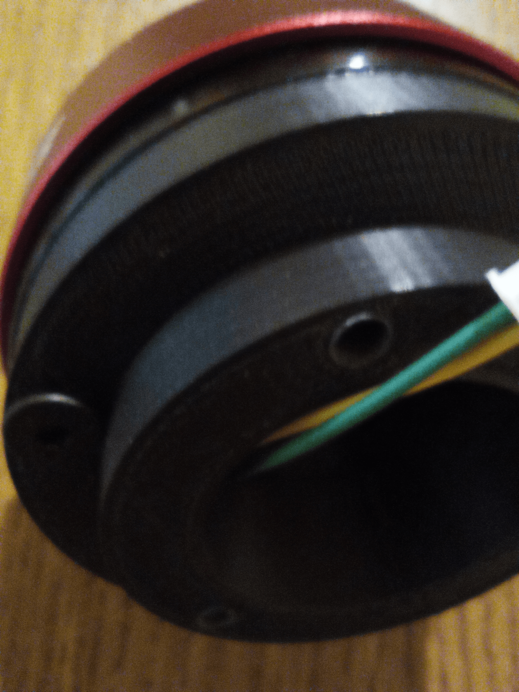

Try not to mount the QR upside down, otherwise you will have to recenter your wheel base each time you change to another wheel.

### Attach the LED segment display to the CSUH's housing

If you don't do this now, you won't be able to do it later. The purpose is to cover that hole. You may use isolating tape instead.

Insert the display into the housing in horizontal position. You may notice that it gets loose, but there is a trick to keep it in position. Insert wooden toothpicks into the small slots at each side of the display. See picture.

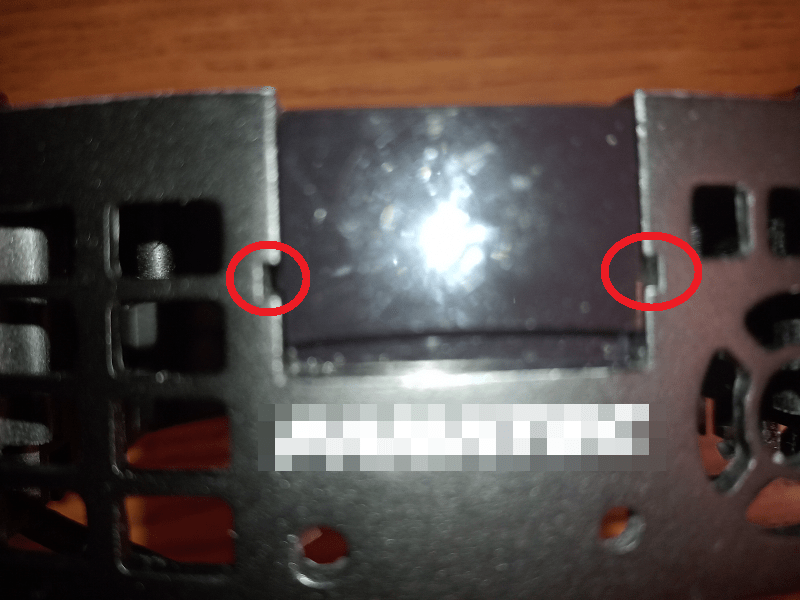

Then, trim the excess of wood using a cutter.

### Put some screws in their holes

Two half-threaded M4 screws, 32mm-long, have to be inserted into their holes right now (from the back of the steering wheel). They come from the CSUH itself. **If you don't do this now, you won't be able to do it later**. Those are the two ones closer to the bottom of the steering wheel. Hold them in place with a piece of isolating tape.

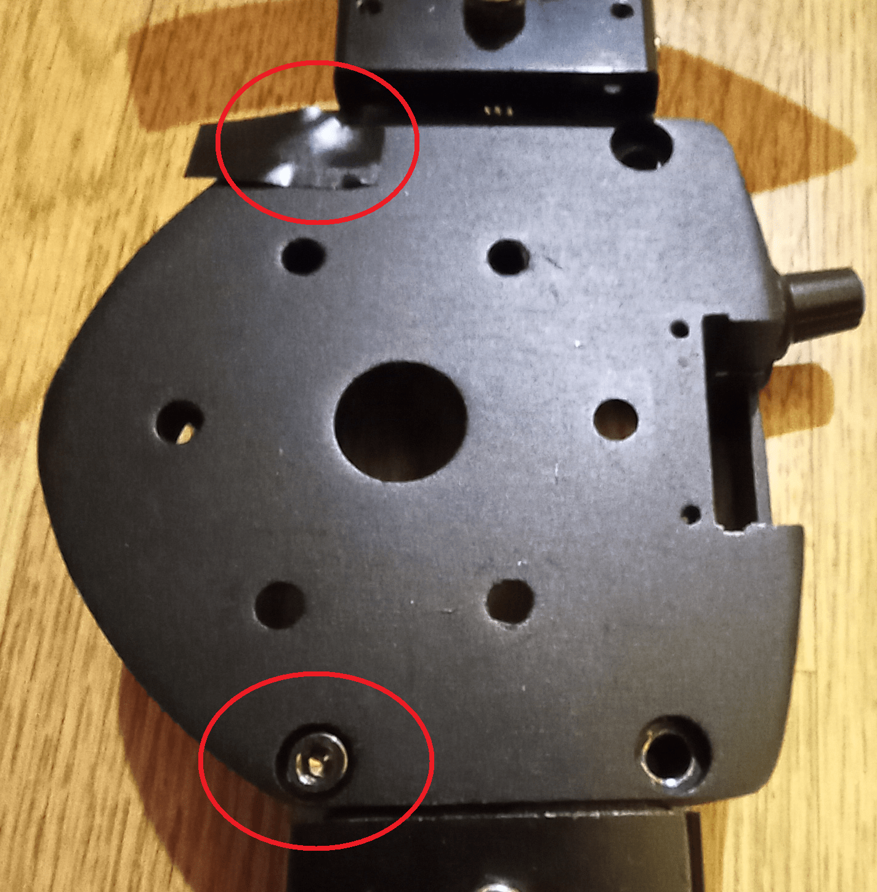

### Cover the holes left by unused rubber buttons

This is mostly an aesthetic issue, but it will prevent dust from coming into the circuit board. The rubber buttons are not used anymore, so you should cover the empty holes. You may use isolating tape or cardboard, but a better option is to reuse the rubber buttons even if they are not operational:

- On the left side, just put the rubber buttons in its place and hold them with isolating tape or a drop of glue.

- On the right side, we are using the hole that previously held the "A" button as a mounting point for the rotary encoder. Remove the "A" button from the rubber using a cutter, as shown in the picture. Put the rubber in its place. Later, the rotary encoder will hold it in position:
  
  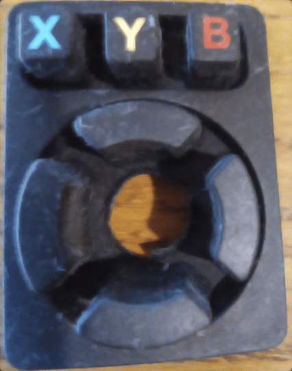

### Attach the rotary encoder to the CSUH's housing

This is straight forward. Insert the rotary encoder from the inner side into the hole in the rubber. On the outer side, put the washer first, then the nut. Tighten it using pliers.

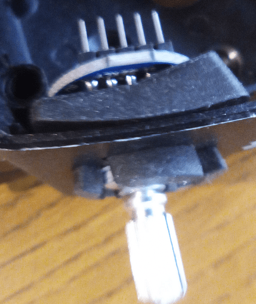

### Attach the QR adapter to the CSUH's housing

We are reusing **three** M5 screws, 12mm-long, from the CSUH. Note that these screws are not the ones that previously hold the Fanatec's QR, but the steering wheel.

Make sure the power wires from your QR come into the housing through the center hole.

If you are mounting the 70mm QR adapter, make sure the outer notches are facing down, so the QR adapter does not come in the way of other screws.

**Note for the Simagic QR:** the "Simagic" logo should stay at the top of the housing. Otherwise, you will have to recenter each time you insert another wheel into the base.

### Attach the circuit board to the CSUH's housing

We are reusing a single M3 screw from the CSUH. No need for more. Put the circuit board into the housing, matching the top-right mounting hole (previously drilled) with the existing mounting point. Insert the screw and tighten.

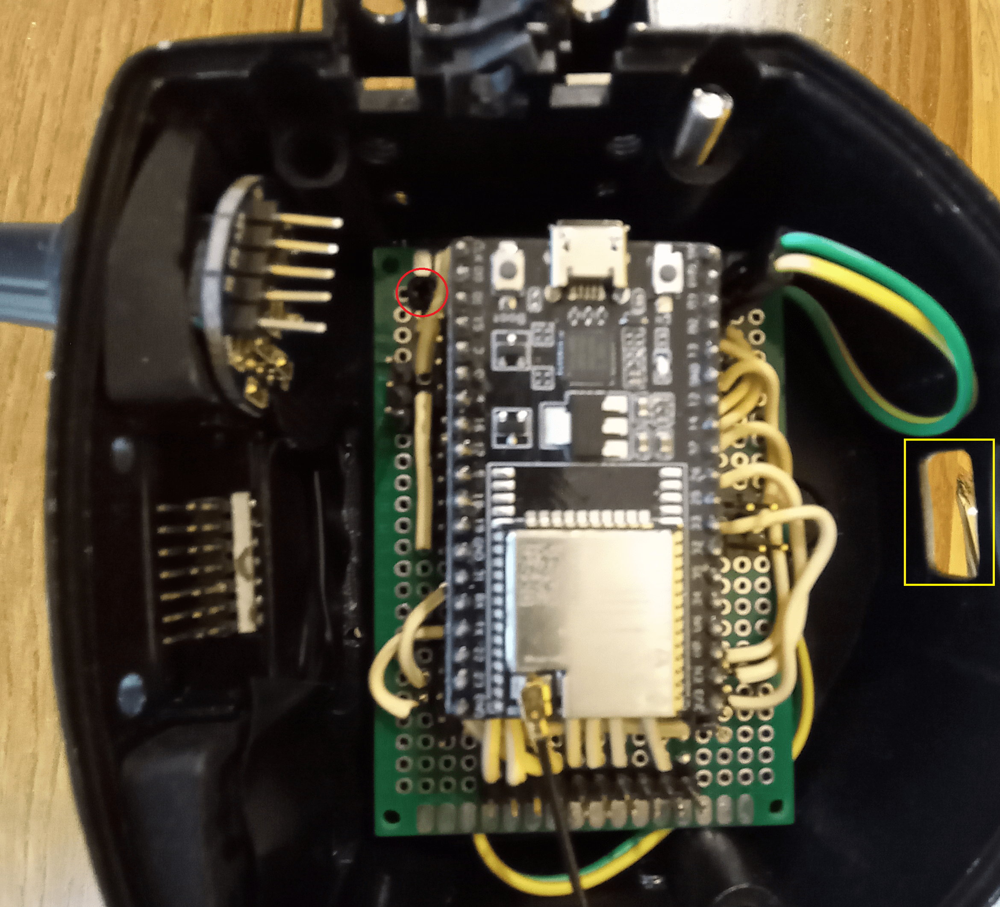

### Route the external antenna to the outside of the CSUH's housing

Pass the antenna through the hole left by the USB connector at the bottom of the housing. Notice the yellow rectangle in the previous picture. Attach it to any place you like with isolating tape or adhesive. A piece of isolating tape could cover the USB hole, too.

### Plug connectors into the circuit board

Straight forward. Take care not to to plug those connector in reverse order. Look at the mark (black wire) at each connector in order to plug them with the correct orientation.

You have to put the lid in place for this.

### Tighten the CSUH's lid and the steering wheel itself

- **Be careful not not to bite any wire with the lid**.

- Tighten the lid using the M4, half-threaded 32mm-long, screws (x4) as they were before.

- Tighten the wheel rim using the remaining three M5 screws, 12mm-long. No need for more. Put them as shown in the picture below. Otherwise, you may damage the circuitry inside.
  
  

- For the aesthetics, you may cover the other three holes with three M5 screws, 5mm-long, that previously held the 52 mm Fanatec's QR.

## Section III: Additional information

### CSUH's pin-outs and color schemes

#### 3-Button Modules

| Order | Color |           Function           |
| :---: | :---: | :--------------------------: |
|   1   | Black | Common pole for all switches |
|   2   | Green |    Rightmost switch pole     |
|   3   | White |      Center switch pole      |
|   4   |  Red  |     Leftmost switch pole     |

Look at this wiring in [falstad.com](https://falstad.com/circuit/circuitjs.html?ctz=CQAgjCAMB0l3BWcMBMcUHYMGZIA4UA2ATmIxAUgoqoQFMBaMMAKAGdwNDwU8QUE3MLyjgQAMwCGAGzZ12nIV36DFoiFNnyOYZShQAWFd31GqGmXJYB3Yzz64jwvpBt3d3R2te2BJwyBeplBuHvZqYT4RymHBUWEJIpEsAB7IEGCE2OAG5oTcTiggAEIAMgCCAMIA0qn8xEK6gSjEPFSFIADiAE50dAB2dS1ChEjYROCEfB0A6gAWAJYALvJpLRAoYGNg2ZvTPCAASnQAJixAA)

#### 7-way Funky Switch (incremental rotary encoder + D-PAD + push button)

This funky switch is manufactured by ALPS, RKJ series.

| Order | Color  |               Function                | Manufacturer tag |
| :---: | :----: | :-----------------------------------: | :--------------: |
|   1   | Black  |              Push button              |       Push       |
|   2   | Brown  |                 Down                  |        C         |
|   3   |  Red   |               Rotation                |   Encoder com    |
|   4   | Orange |               Rotation                |    Encoder A     |
|   5   | Yellow |                 Right                 |        D         |
|   6   | Green  |                 Left                  |        B         |
|   7   |  Blue  |               Rotation                |    Encoder B     |
|   8   | Purple |                 None                  |       None       |
|   9   |  Grey  |                  Up                   |        A         |
|  10   | white  | Common pole for D-PAD and push button |       COM        |

Both `COM` and `Encoder com` should be wired to ground. Other terminals should get pulled up through a resistor.

Look at this wiring in [falstad.com](https://falstad.com/circuit/circuitjs.html?ctz=CQAgjCAMB0l3BWcMBMcUHYMGZIA4UA2ATmIxAUgoqoQFMBaMMAKAGcLiURjCQNIAFh58qEAGYBDADZs67TtzCDhA4cuFiQU2fI4Iu4Q2qPctOuQoPcUgqidtVzMy-sMo8efkJAevz3RYAd0URUI0oYPCVcMNIKOtTUMdIkMSU9M9U2O4EMCU4lgBlUOxCLxMy-yhtFzoalCjCfBAqig9W8siADxBBPD4wAgoEJCGkdW4AdQALAEsAFzoAHTYACgBhAHkAWQBKFl7+vmxBYk4kbARuSZAAJToAE1W1gFEAOwBjAHtHugAnVbbfaHEAkPhZDCEYTECC3ABC0kknwA1i8AAoAVzYMwOvRI2HAZX4gnIYGw5wR-2+QXeLw2eLBxEJp2EeDgrVJfXA3C2-0k7wA5it1h8fn9AWwAIKMgl9SDcDB4YR2CY8kCIzEit5fX4A1bw2WGIaqQSDPDkW4ATTo0mkNJeABEjVQULgSTZsITbgBxf50Oh09aG0Hlc6YPg4YSYSnqv10ACeLxlLEFFHySTyNlsNXiaeuXjaBflTkiQA)

### Pin-out plan for the ESP32-Devkit-C board

| **GPIO** | **Input**  | **Output** |        **Usage**         | **Notes**                              |
| -------- | ---------- | ---------- | :----------------------: | -------------------------------------- |
| **36**   | OK         |            |    Funky switch - up     | input only (no internal pull resistor) |
| **39**   | OK         |            | Funky switch - encoder B | input only (no internal pull resistor) |
| **34**   | OK         |            |   Funky switch - left    | input only (no internal pull resistor) |
| **35**   | OK         |            |   Funky switch - right   | input only (no internal pull resistor) |
| **32**   | OK         | OK         |    Left shift paddle     |                                        |
| **33**   | OK         | OK         |        Button "Y"        |                                        |
| **25**   | OK         | OK         |    Right shift paddle    |                                        |
| **26**   | OK         | OK         |        Button "X"        |                                        |
| **27**   | OK         | OK         |      Button "Back"       |                                        |
| **14**   | OK         | OK         |        Button "A"        | outputs PWM signal at boot             |
| **12**   | OK         | OK         |        Button "B"        | boot fail if pulled high               |
| **13**   | OK         | OK         |      Button "Start"      |                                        |
| **9**    | x          | x          |       **UNUSABLE**       | connected to the integrated SPI flash  |
| **10**   | x          | x          |       **UNUSABLE**       | connected to the integrated SPI flash  |
| **11**   | x          | x          |       **UNUSABLE**       | connected to the integrated SPI flash  |
| **6**    | x          | x          |       **UNUSABLE**       | connected to the integrated SPI flash  |
| **7**    | x          | x          |       **UNUSABLE**       | connected to the integrated SPI flash  |
| **8**    | x          | x          |       **UNUSABLE**       | connected to the integrated SPI flash  |
| **15**   | OK         | OK         |       Button "RB"        | outputs PWM signal at boot             |
| **2**    | OK         | OK         |       Button "RT"        | connected to on-board LED              |
| **0**    | pulled up? | OK         |       Button "RSB"       | outputs PWM signal at boot             |
| **4**    | OK         | OK         |                          |                                        |
| **16**   | OK         | OK         | Funky switch - encoder A |                                        |
| **17**   | OK         | OK         |     Rotary encoder A     |                                        |
| **5**    | OK         | OK         |     Rotary encoder B     | outputs PWM signal at boot             |
| **18**   | OK         | OK         |   Rotary encoder Push    |                                        |
| **19**   | OK         | OK         |   Funky switch - down    |                                        |
| **21**   | OK         | OK         |   Funky switch - push    |                                        |
| **3**    | pulled up  | RX pin     |       Button "LB"        | HIGH at boot                           |
| **1**    | TX pin     | OK         |                          | debug output at boot                   |
| **22**   | OK         | OK         |       Button "LSB"       |                                        |
| **23**   | OK         | OK         |       Button "LT"        |                                        |
