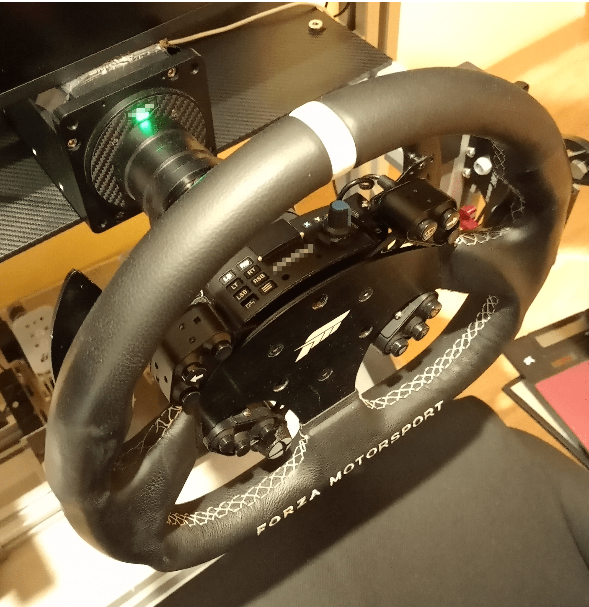

# Conversion of a Fanatec's ClubSport Universal Hub to other sim bases

The purpose of this project is to adapt an existing *ClubSport Universal Hub* (CSUH) to any other sim base, **as long as it provides DC power** through the Quick Release (not suitable for *SimuCube* bases). This has been tested in a *Simagic* base.

This project is **fully operational** and provides some **extra features**:

- Buttons `LT` and `RT` can be configured into three modes at any time:
  - Regular buttons
  - **Alternate buttons**. While pressed, any input is reported as an alternate one, thus, duplicating the number of effective inputs. Much like the SHIFT key in your keyboard.
  - **F1-style clutch** with bite point calibration.
- An additional **rotary encoder** with a builtin push button.
- **Wireless** operation.

But it has some inconveniences:

- Rubber buttons will be disabled.
- The LED segment display will not work anymore.

You may found this project suitable for other sim wheels and bases with some tweaks.

Project **cost**: less than 100 euro at the time of writing.

An optional [companion app](https://github.com/afpineda/SimWheelESP32Config) is available for the extra features (Windows 64-bits only).

## Requirements

- Bluetooth Low Energy (BLE) 4.2 (or higher) at your host computer. Recommended BLE 5.0.
- Any modern operating system will work, but the Windows brand requires Windows 10 build 1903 or later.
- 5V DC power through the sim base. Higher voltages up to 12V are allowed, but not recommended.

## Index

- [User manual](./UserManual/UserManual.md)

- [Build manual](./BuildManual/BuildManual.md)

## Citations

- This project takes code from this one: [Open source wireless steering wheel/button box for ESP32 boards](https://github.com/afpineda/OpenSourceSimWheelESP32)

## Change log

- 1.0.0:
  - First release.
