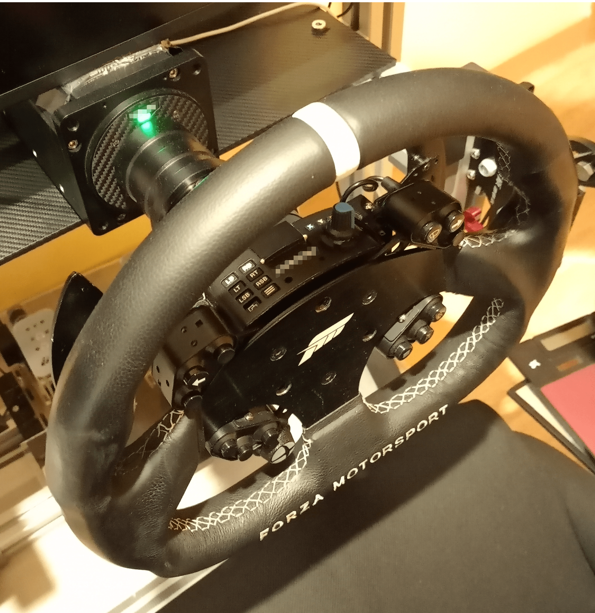

# Conversion of a Fanatec's ClubSport Universal Hub to other sim bases

The purpose of this project is to adapt an existing
*ClubSport Universal Hub* (CSUH) to any other sim base,
**as long as it provides DC power** through the Quick Release
(not suitable for *SimuCube* bases).
This has been tested in *Simagic* and *Moza* bases.

This project is **fully operational** and provides some **extra features**:

- Buttons `LT` and `RT` can be configured into several modes at any time:
  - Regular buttons
  - **Alternate buttons**.
    While pressed, any input is reported as an alternate one,
    thus, duplicating the number of effective inputs.
    Much like the SHIFT key in your keyboard.
  - **F1-style clutch** with bite point calibration.
  - **Launch control** with user-selected master button.
- An additional **rotary encoder** with a builtin push button.
- **Wireless** operation.

But it has some inconveniences:

- Rubber buttons will be disabled.
- The LED segment display will not work anymore.

Project **cost**: less than 100 euro at the time of writing.

An optional [companion app](https://github.com/afpineda/SimWheelESP32Config)
is available for the extra features.

## Requirements

- Bluetooth Low Energy (BLE)
- Any modern operating system will work.
- 3.3V to 15V DC power through the sim base.

## Index

- [User manual](./UserManual/UserManual.md)

- [Build manual](./BuildManual/BuildManual.md)

## Citations

- This project takes code from this one:
  [Open source wireless steering wheel/button box for ESP32 boards](https://github.com/afpineda/OpenSourceSimWheelESP32)
  **version 8.1.0**.

## Change log

- 2.0.0:
  - Code upgraded to OSSW 8.1.0.
  - Additional advice for MOZA bases (having a 12.5V power supply).
- 1.0.0:
  - First release.
